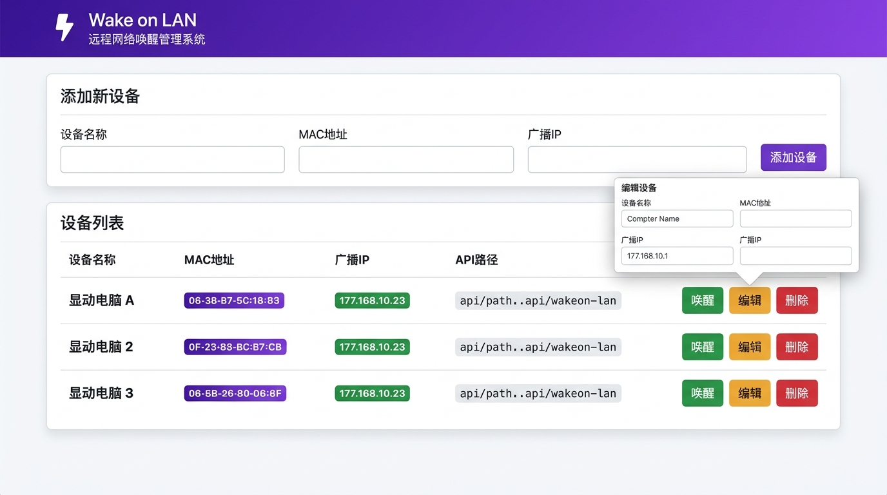

# Wake on LAN — Go REST Server

> 通过 HTTP 请求发送 Wake-on-LAN 魔术包，带 Web 管理界面，数据存储使用 SQLite。



---

## 功能特性

- 🌐 **Web 管理界面** — 添加、编辑、删除设备，一键唤醒
- ⚡ **REST API** — 通过 HTTP GET 远程发送 WOL 魔术包
- 🗄️ **SQLite 存储** — 数据持久化，无需外部数据库
- 🐳 **Docker 支持** — 一行命令运行

---

## 界面截图

页面支持：
- **添加设备**：输入名称、MAC 地址、广播 IP
- **编辑设备**：点击编辑按钮，弹窗修改后保存
- **删除设备**：一键删除
- **唤醒设备**：点击唤醒按钮，发送 WOL 魔术包

---

## REST API

### 唤醒设备

```
GET /api/wakeup/computer/<ComputerName>
```

**返回示例：**

```json
{
  "success": true,
  "message": "Succesfully Wakeup Computer MyPC with Mac AA:BB:CC:DD:EE:FF on Broadcast IP 192.168.1.255:9",
  "error": null
}
```

### 添加设备

```
POST /api/add/computer
Content-Type: application/json

{
  "name": "MyPC",
  "mac": "AA:BB:CC:DD:EE:FF",
  "broadcastIp": "192.168.1.255"
}
```

### 编辑设备

```
PUT /api/update/computer/<ComputerName>
Content-Type: application/json

{
  "name": "MyPC-New",
  "mac": "AA:BB:CC:DD:EE:FF",
  "broadcastIp": "192.168.1.255"
}
```

### 删除设备

```
DELETE /api/delete/computer/<ComputerName>
```

---

## 配置

### 环境变量

| 变量名        | 说明                                          |
|--------------|-----------------------------------------------|
| `WOLHTTPPORT` | Web 服务器监听端口，默认 `8080`               |
| `WOLDB`       | SQLite 数据库文件路径，默认 `./computer.db`   |

### 命令行参数

| 参数     | 示例                      | 说明                                |
|---------|--------------------------|-------------------------------------|
| `--port` | `--port 80`              | Web 服务器监听端口，默认 `8080`      |
| `--db`   | `--db /data/wol.db`      | SQLite 数据库文件路径               |

---

## Docker

```bash
# 构建镜像
docker build -t go-rest-wol .

# 运行（挂载数据库文件持久化数据）
docker run -p 8080:8080 -v $(pwd)/data:/app/data \
  -e WOLDB=/app/data/computer.db \
  go-rest-wol
```

使用自定义端口：

```bash
docker run -p 9090:9090 -v $(pwd)/data:/app/data \
  -e WOLHTTPPORT=9090 \
  -e WOLDB=/app/data/computer.db \
  go-rest-wol
```

### docker-compose

```yaml
version: '3'
services:
  wol:
    build: .
    ports:
      - "8080:8080"
    volumes:
      - ./data:/app/data
    environment:
      - WOLDB=/app/data/computer.db
```

---

## 本地开发

```bash
git clone https://github.com/cute-angelia/WOL-FORK.git
cd WOL-FORK
go mod tidy
go run main.go
# 访问 http://localhost:8080
```

---

*Based on [go-rest-wol](https://github.com/dabondi/go-rest-wol) by David Baumann.*
